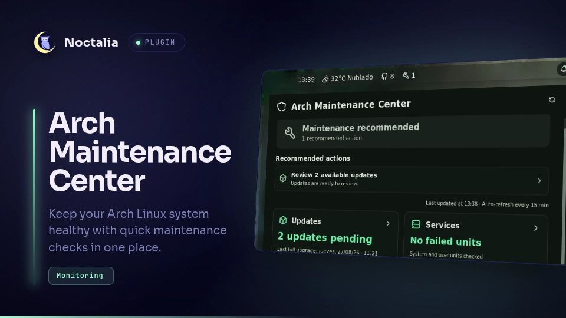

# Arch Maintenance Center

A read-only Arch Linux health dashboard for the Noctalia v5 bar.



## What it checks

- pending repository updates, a bounded package sample, and the age of the
  last full system upgrade;
- failed system and user services, with bounded unit samples;
- root filesystem usage, pacman cache, orphan packages, and journal storage;
- recent error-priority journal events visible to the current user.

Before running any collection, the service reads `/etc/os-release` and requires
`ID=arch`. On another distribution, or when that file cannot be verified, the
panel explains that the diagnosis is unavailable and does not offer Arch
maintenance commands.

The bar widget opens a native Noctalia panel with the current diagnosis. The
panel can open details for each area, copy a redacted summary, and copy
read-only inspection commands. It never runs updates, cleanup, repairs, or
privileged commands. The Updates detail can copy `sudo pacman -Syu` after an
explicit warning; it does not run the command.

The overview also presents evidence-backed recommendations. Pending updates,
failed units, high root filesystem usage, and orphan packages open their
existing detail views. Recent journal errors and storage totals remain
informational and do not become recommendations by themselves.

For visual development, enable the advanced `Developer tools` setting. The
panel then exposes a temporary `Data source` selector with healthy, warning,
critical, incomplete, loading, and platform fixtures. Demo snapshots are
explicitly marked, affect the widget as well as the panel, never run collectors,
and reset to `Real system` when the plugin reloads. Copying the diagnosis stays
available for review; system and upgrade commands are disabled for fixtures.

## Requirements

- Noctalia v5.0.0-beta.9 or newer with plugin API 24;
- Arch Linux with `ID=arch` in `/etc/os-release` and systemd;
- `pacman-contrib` for the `checkupdates` command;
- `jq` for bounded journal preprocessing;
- `bash`, `awk`, `grep`, `tail`, `du`, `pacman`, and `journalctl`
  (normally supplied by the base system).

When `pacman-contrib` is missing, the rest of the diagnosis remains available
and the updates card explains the missing dependency.

Updates invokes a fixed read-only command based on `checkupdates --nocolor`
and retains the count plus at most eight name/version records. It reads at most
one matching `starting full system upgrade` line from `/var/log/pacman.log`;
an unavailable log still produces a ready updates result with an unknown date.
Commands have bounded timeouts and the service has a 35-second watchdog, so a
slow mirror, unavailable service, or lost callback cannot leave the whole
diagnosis refreshing indefinitely.

The Services card checks failed `systemd` units in both the system and user
scopes, retains at most 20 units per scope, and marks the diagnosis as partial
when the user scope cannot be read. Cleanup sources remain independent, so a
single unavailable source is visible as partial rather than hiding the others.
System Logs preprocesses at most eleven events per scope outside the Luau
callback, then shows the ten most recent normalized errors from the current
boot; raw log messages are never copied into the diagnosis. Pacman cache size
excludes private `download-*` directories that cannot be inspected without
elevated privileges.

The panel uses Noctalia palette roles rather than fixed colors, so backgrounds,
text, accents, borders, and controls follow the active light or dark theme.

## Usage

Enable **Arch Maintenance Center** in Noctalia's plugin manager, add the
`health` widget to a bar, and click it to open the dashboard. Right-click the
widget or use the panel refresh action to check again.

Refresh externally with:

```bash
noctalia msg plugin alexmnrs/arch-maintenance-center:monitor all refresh
```

Open the dashboard with:

```bash
noctalia msg panel-toggle alexmnrs/arch-maintenance-center:dashboard
```

## Privacy and safety

The plugin reads local package, service, and disk information without `sudo`.
It stores no diagnosis on disk and excludes usernames, hostnames, network
addresses, personal paths, and raw command output from copied diagnoses.

## License

[MIT](../LICENSE)
